### 1.接口

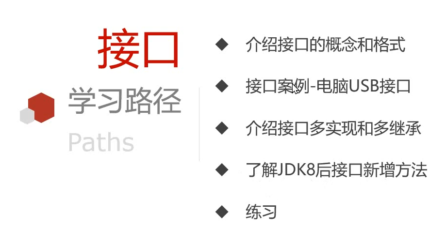

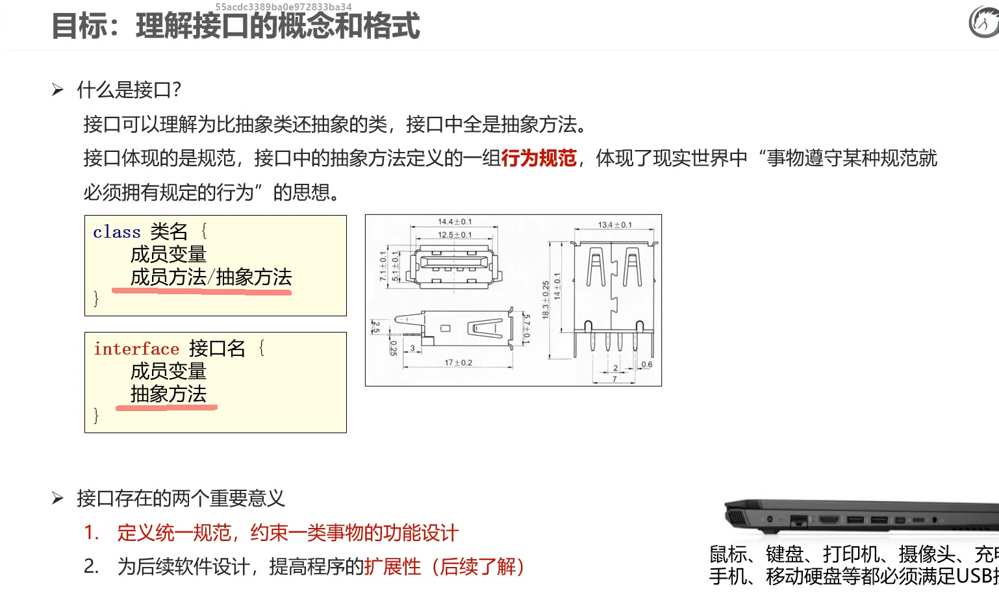

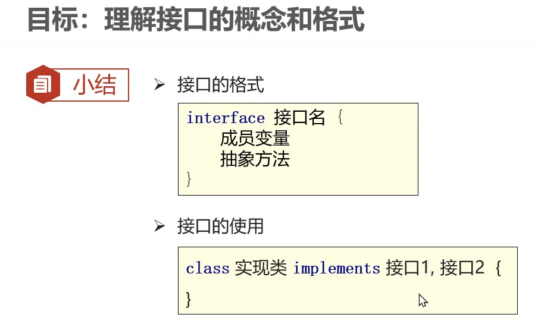

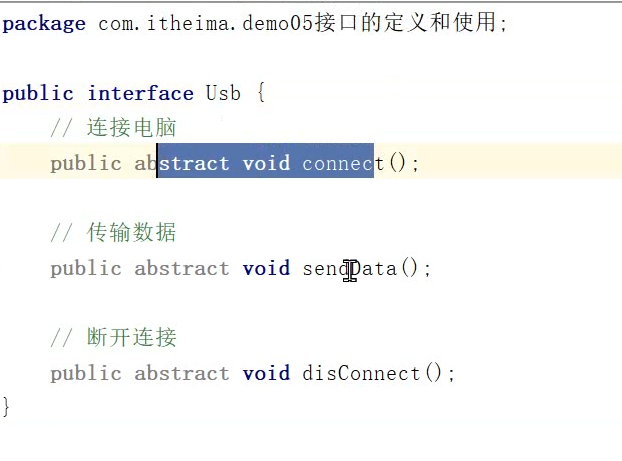

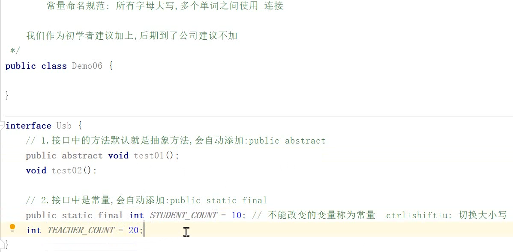

#### 类单继承多实现，接口可以多继承

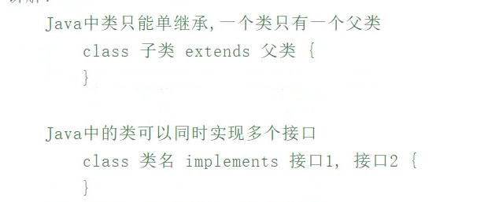

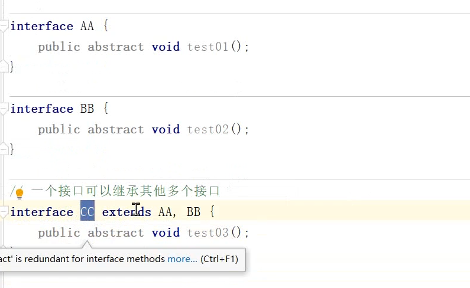

#### JDK8以后接口新增的方法

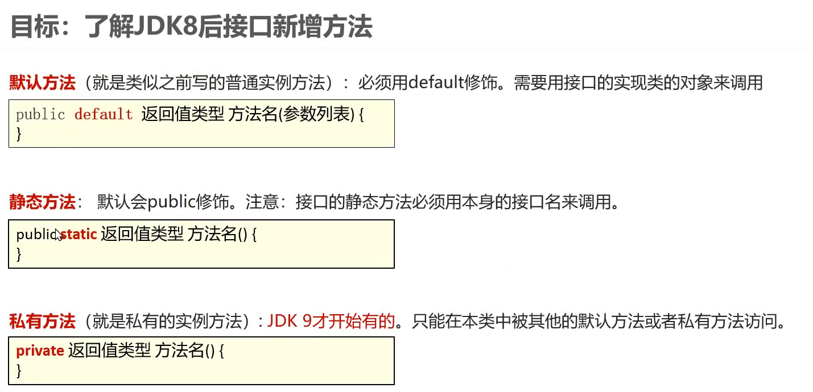

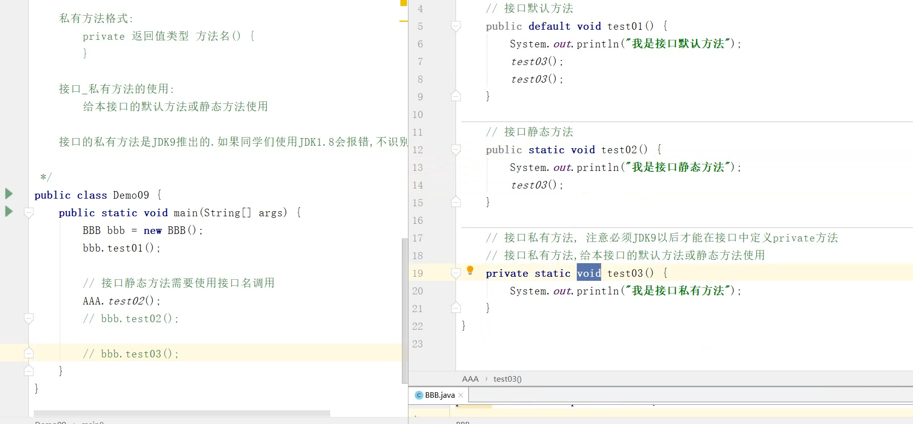

#### 接口和抽象类的区别

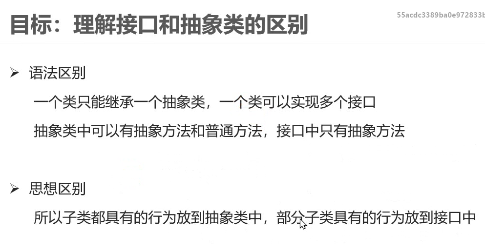

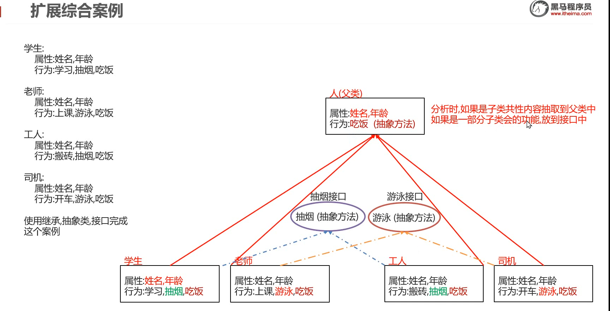

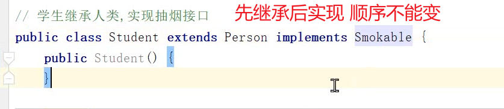

``注：先有父亲后有师傅``

### 2.权限修饰符

#### 权限修饰符的分类和作用

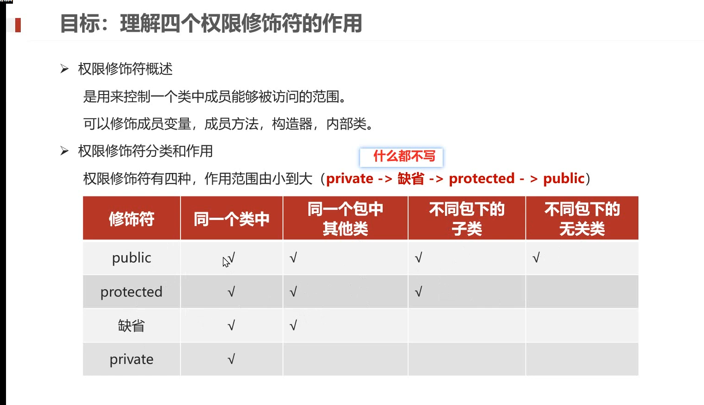

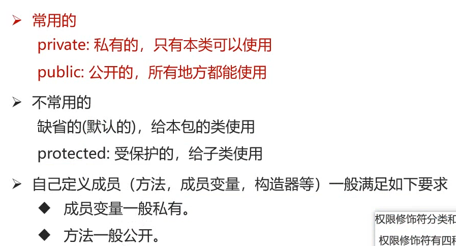

### 3.代码块

#### 静态代码块和构造代码块

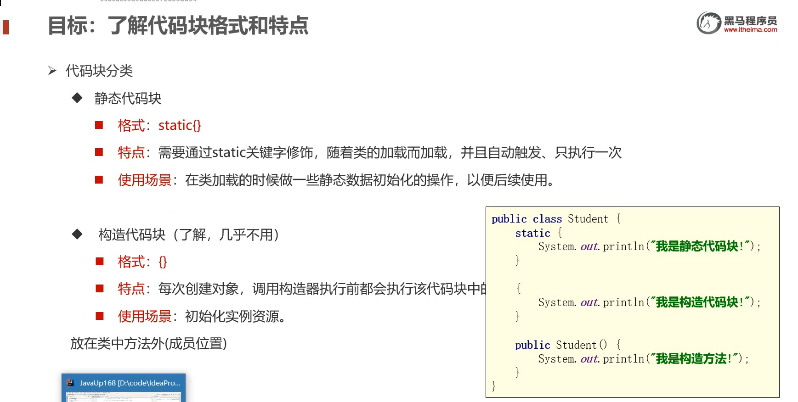

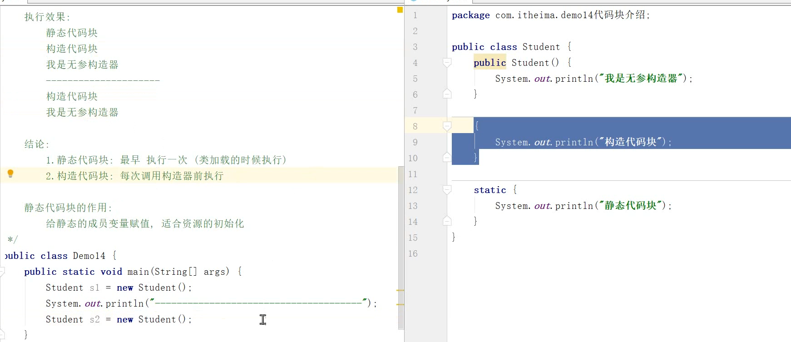

**斗地主的54张牌的初始化**

### 4.final关键字

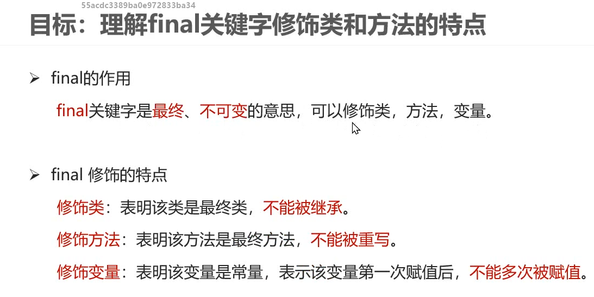

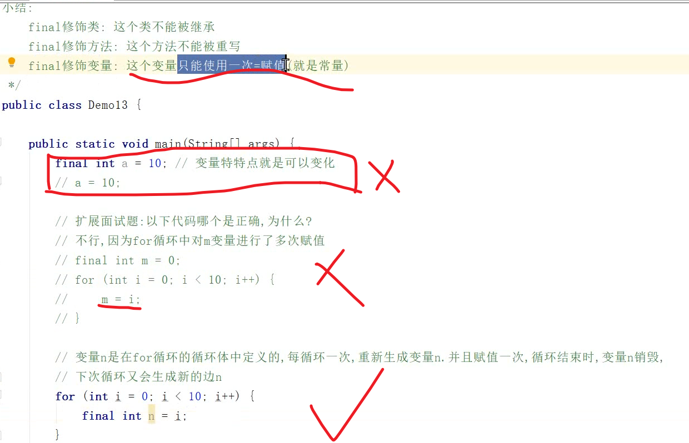

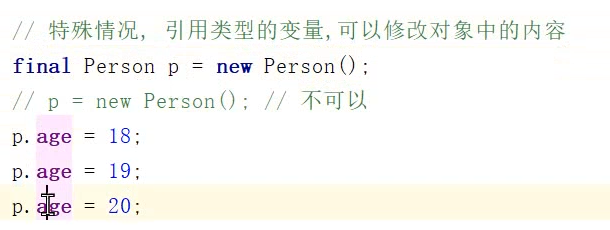

### 5.idea自定义快捷键 

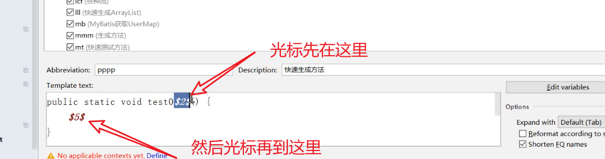