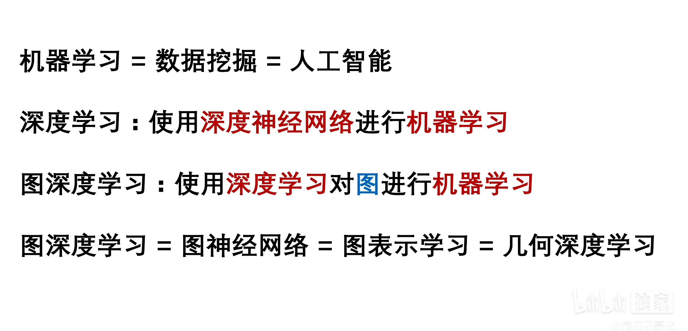
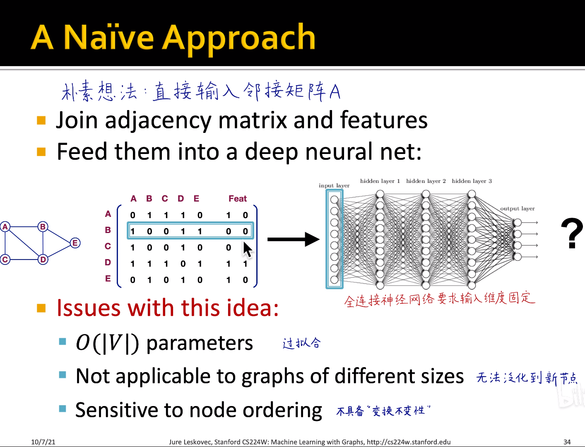
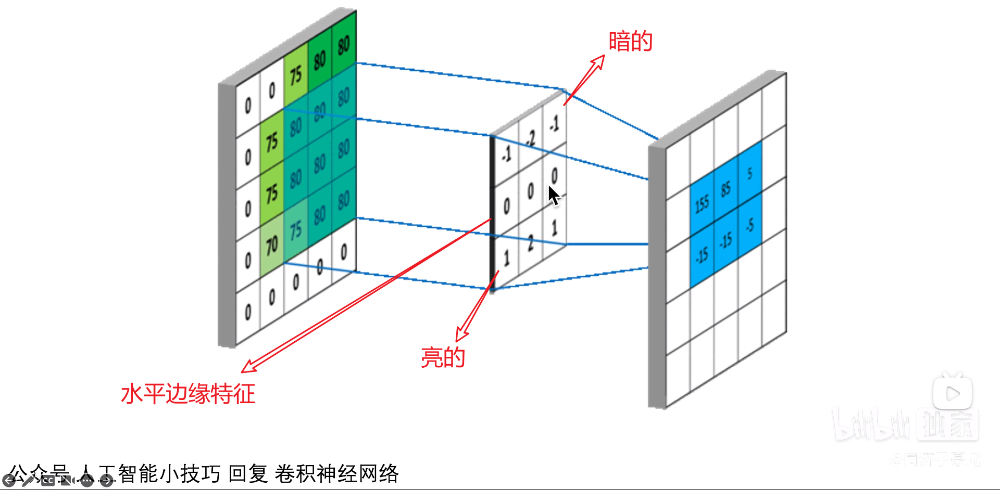
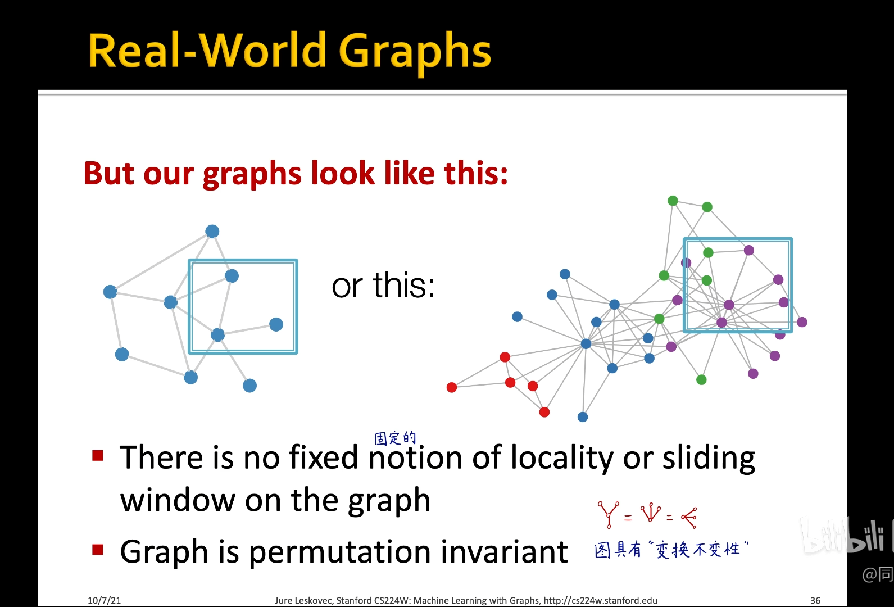

## 图神经网络

#### 推荐几个小众但适合发论文的AI研究方向(同济子豪兄)

### 图神经网络的应用

##### 土木工程的运用

##### 啥叫表示学习

#### 图神经网络基础及应用

#### 图深度学习的难点和挑战

- 深度学习任务是为矩阵（图像）和序列（语言，语音识别）而生的
- 如何把图（节点和边的图）输入到深度学习的任务中十分重要

##### 邻接矩阵A包含了节点相互连接的所有信息能否直接将邻接矩阵A输入神经网络中?

**不可行**

- eg：14亿人邻接矩阵太稀疏，会导致参数爆炸，导致过拟合
- eg：全连接神经网络 输入的维度固定。若再有一个新的宝宝诞生，则邻接矩阵多出来一维，就要重新训练，泛化能力差
- eg：结点编号改变 则model输出结果也会改变

##### 我们的目标：找到置换不变函数

##### 能否参考已有的神经网络结构? 例如,卷积神经网络

卷积神经网络使用卷积核去滑动图像 得到特征

不可行 

图具有变换不变性 看下面 相同的图

#### 图卷积神经网络  计算图

``注：使用邻居对A的看法加上A的特征 迭代更新得到A的embedding``

``注：每一个计算图就是一个样本``

``注:层数不能太深，还需要一些剪枝等等的操作``

#### summary

