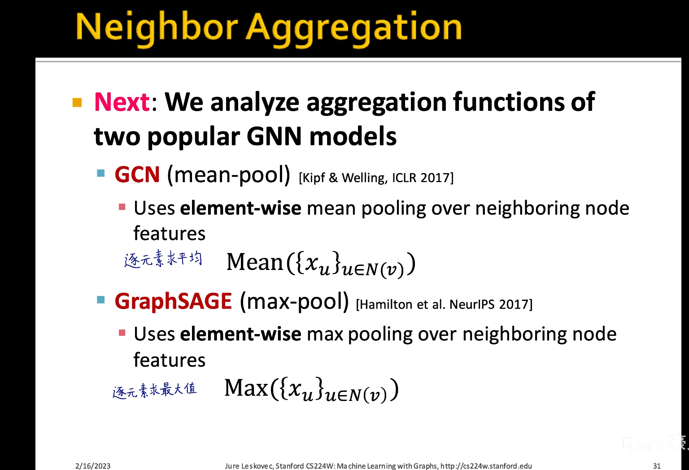
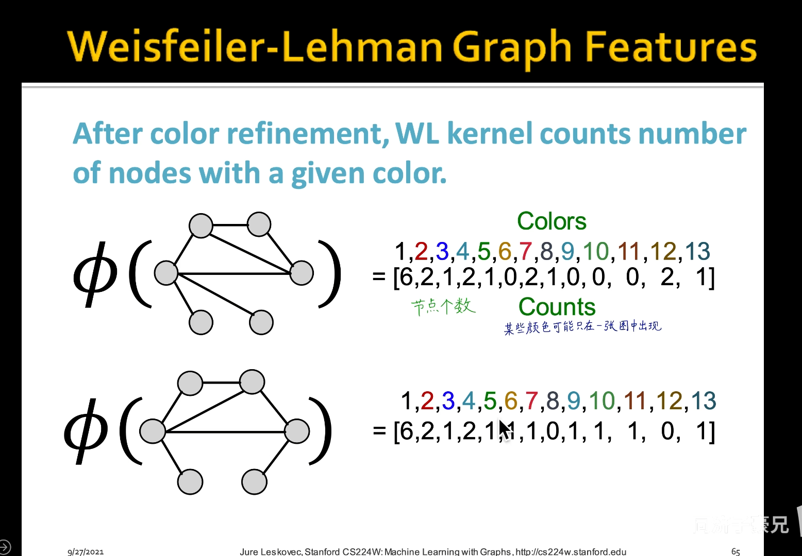
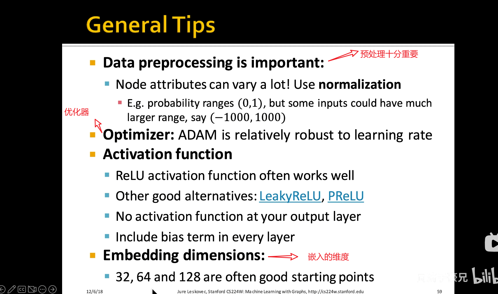

### 图神经网络的表达能力

``注：GraphSAGE和GAT没讲``

#### 形成全图的特征工程

#### 神经网络的表达能力

**表达能力：是否能拟和出来一个复杂的边界 去进行分类和回归**

**一般用多层每层用少量的神经元**

**神经网络最后一层就是一个线性分类曾**

#### 图神经网络GNN的表达能力

##### 计算图相同，GNN无法区分

##### 计算图不同，GNN能区分吗?

##### 数学的映射

#### 分析常见GNN的表达能力    并设计出表达能力最强的GNN

##### 两种GNN的对比

``注:这里的AGGREGATE是逐元素求最大值的操作``

##### GCN不是单射函数（求平均）

##### GraphSAGE也不是单射函数（求最大）

##### 想法：使用神经网络构建单射函数

#### Graph lsomorphism(同构) Network  图神经网络GIN

`注:神经元个数不用太多 100-500就够了`

##### WL kernal（传统的ML 人工构造特征） 是消息传递GNN的上限

##### GIN类比WL kernal

##### 表达能力的对比

``注:1.eg:蓝色的为列向量[1,0] 红色的为列向量[0,1]``

``2.保证顺序不变性:顺序不变性（Order Invariance）指的是某些操作的结果与它们的输入顺序无关。``

##### 再次提高expressive power 就要跳出消息表达能力的范围

idea： 加入标号属性

#### GNN工程调参技巧

``注:1.zero-grad:是否调到了0梯度或者叫验证测试模式``

``2.仔细观察loss function 和initialization参数 ``

``3.如果出现了overfit 你需要去看train的loss function 和test的loss function是否出现了倒挂？是否要采取早停正则化的技巧``

``4.倒挂:在机器学习中，倒挂（Inverted-U）是一个经验现象，它描述了某些任务在一定程度的难度下，随着问题复杂度的增加，性能表现先得到改善，然后达到峰值，最后性能开始下降。``

#### 复盘总结

