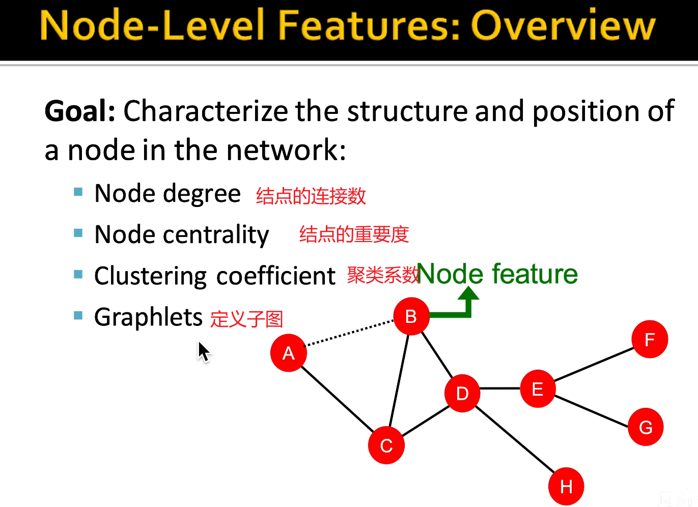

#### 属性特征

一个人的年龄 收入 个性签名等等

#### 连接特征

一个节点在图中是边缘节点还是中心结点 

#### 解决异或问题

#### 特征工程十分重要

机器学习算法只能看懂特征和矩阵

#### node-level

例子：

#### 找每个结点node degree

### node centrality

#### 特征向量重要度

是一个递归的过程 ：想求a 得求a附近的结点c d b 的特征重要度 然后再求c d b 附近节点的特征重要度......

#### betweeness centrality 一个结点的重要度有多少最短路径路要经过它  枢纽

####   

####  closeness centrality 去哪都近

A去哪都远 D去哪都近  

#### clustering coefficient（聚集系数） 有多抱团

### graphlets node feature 

不太理解

