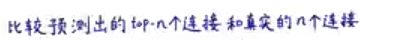

## 连接层面的特征工程

例子：微信qq 推你可能认识的人 

鼓励第一种提取link的特征工程  将link映射为d维向量 

第二种可能会丢失link本身的结构信息 eg：高铁北京到上海 只将两个节点的d维向量拼起来 那中间信息可能丢失

#### 方法：还是将连接映射到d维向量

### 三种连接信息

##### 重要：katz index 

##### 怎样计算katz index  矩阵的k次方

1结点和2结点长度为一的katz index

1结点和2结点长度为二的katz index

##### katz系数公式表示

 discount factor随两节点距离越长折减的就越厉害     因为距离越长数据相对来说不是那么重要

### 总结

### 推荐阅读和问题

- 1.药物分子之间的连接预测 基于论文引用关系在时间上的预测 
- 2.两点的最短路径 两点的共同连接点（根据共同的连接点可以表示两点的关系强弱） 还有两点之间距离为k的连接个数 katz index
- 3.将连接映射成d维向量 输入给机器学习算法 进行预测
- 

