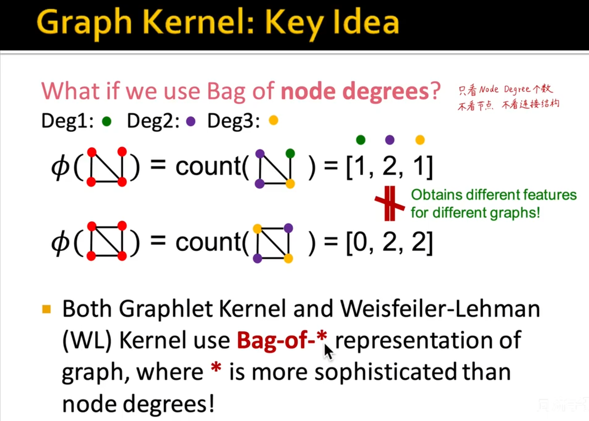
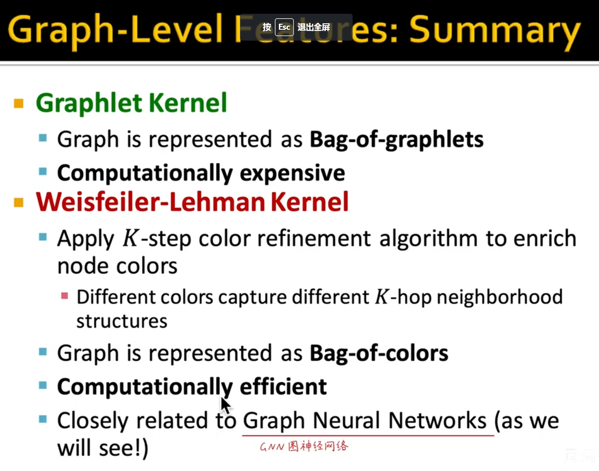

## 全图的特征工程

### Graph Kernal

和结点邻域的Graphlet 不一样 这个是全部的结点 可以有孤立的结点

#### 数量积得出的kernal是个标量  可以反映两个图是否足够相近 有时需要归一化处理

#### 为何不常用用这种算法？  因为需要的算力太大  时间复杂度太高 引入下个算法

### Weisfeiler-Lehman Kernel （维斯菲ler 雷曼 ） 又叫做 bag-of-colors

#### 怎么做

再来一遍 

求kernal 

重复多少次停止呢 ？

与颜色线性相关 与连接个数线性相关  与结点线性相关  相比于Graph kernal 快得多

### summary

#### kernal method 两张图（也可以是子图）进行数量积    kernal代表的是两张图的特征

kernal就可以当成ML的SVM的kernal函数

### 习题和阅读

