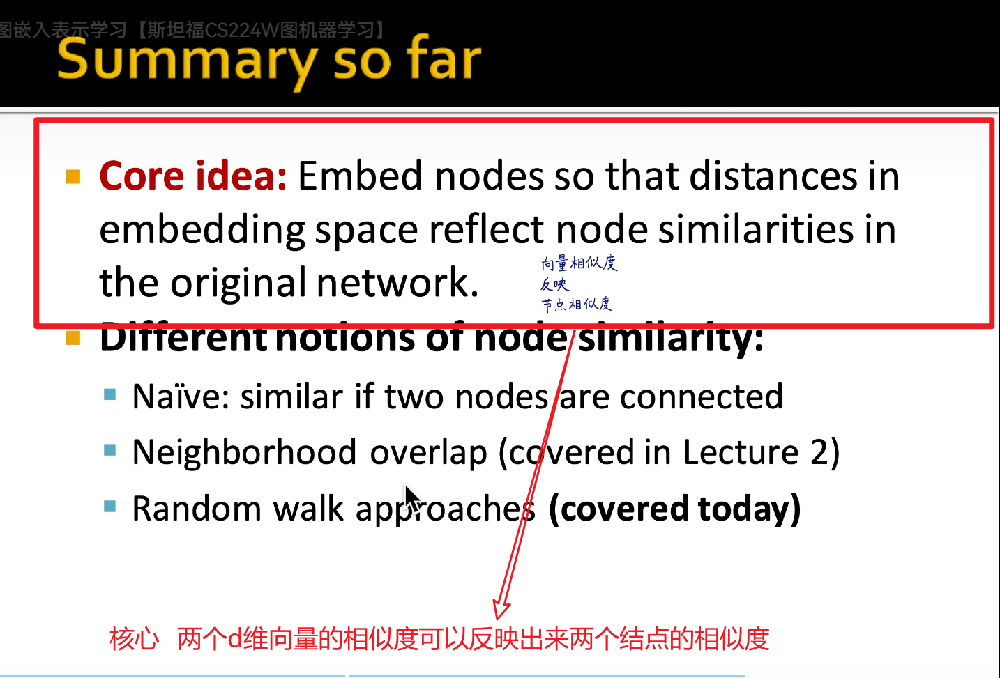
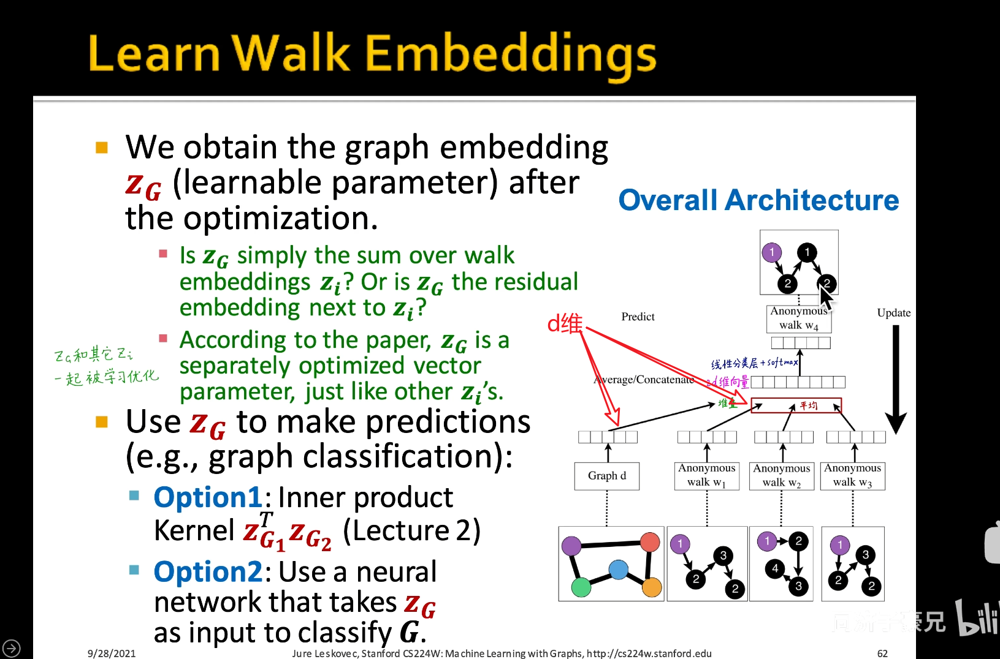

#### 前置视频课

#### 这门课的核心

#### 学习路线

### 图嵌入

#### 传统的机器学习

#### 图表示学习 自动学习特征

##### DeepWalk 将图嵌入到二维矩阵中

###### node的嵌入 （encode node）

##### 相似度可以自己定义

##### 一些相似度的定义 

##### 浅编码（shallow encoding） 使用手动写出来

相对应的是使用深度学习model的深编码  直接输入结点 得到d维向量

#### Random Walk

类比NLP

一些定义 Notation（*n.* 记号, 标记法）

SoftMax相当于归一化处理

极大似然估计

](../../assets/4子豪DeepWalk/image-20230411104950335.png)

类似交叉熵

##### 损失函数

时间复杂度O(n2)

#### 解决softmax难算的问题 

- 分层softmax
- 负采样

##### 介绍负采样

直接随机采k个结点（样本）

#### 优化的方法 （使用随机梯度下降来求最小损失）

- 

- 

- 相当于自己学的三种

​		批量梯度下降 速度慢 但是准

​		随机梯度下降 快  但不一定准 次数多也能达到准确？ 

​		小批量梯度下降  两者的折中 

#### 将以上步骤总结

以上随机游走是完全随机的 可不可以优化一下

### Node2Vec（随机游走（random walk）的优化）

#### idea 想法

#### 2阶的随机游走

所谓的2阶是指 记得自己是从那个结点过来的

#### node2vec的流程

#### 其他的随机游走的策略

#### summary（核心思想）

``1.Z矩阵也就是结点映射成为d维矩阵（d也就是z的行数）``

``2.Z矩阵也就是图嵌入和矩阵分解的结果``

### 邻接矩阵的分解得到Z矩阵

#### 随机游走 node2vec也可以做矩阵分解

太复杂

论文推导

### 矩阵分解的缺点（limitation）

#### 1.每次新加入一个节点就要全部调整(图的结构被改变了) 

#### 2.随机游走 不能够看出结构相似 只反映地理上相近

``解决：匿名随机游走(Anonymous Random walk) 或者 图神经网络(GNN)``

#### 3.仅利用了连接的信息 没有利用结点的属性信息

``GNN不仅考虑到了连接信息也考虑到了属性信息``

### summary 总结

**将图转换为矩阵 使用线性代数的方法或者矩阵运算很重要**

#### 讨论 问题 各自的优缺点

### 嵌入整张图(子图或者整张图)

#### approch1：对每一个结点d维向量求和

#### approch2：虚拟节点 此节点与图中每一个结点相连

#### approch3：匿名随机游走 认号不认人

​     ``数学公式``

#### 匿名随机游走的另一种策略

#### 为何要构建这个任务（全图WG  w1 w2 w3去预测w4）因为要构建一个子监督学习任务

``这是一个极大似然估计的自监督学习任务``

#### summary

### preview

``神经网络也是这么做的``

#### 这节学习的不需要人工特征 是自监督学习任务

#### 问题和论文

