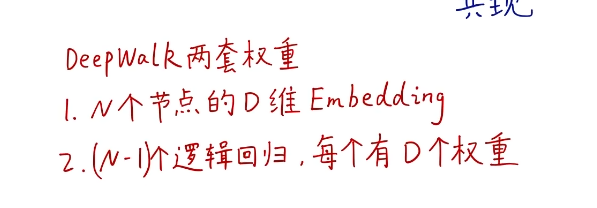

### 学习路线

### word2vec （node2vec的父亲）

#### 两种方法构建自监督任务 将所有词映射到d维向量（低维稠密连续） 这些d维向量能较好的表现这些词的原本关系

##### skip-gram 自监督学习

**在deepwalk中随机游走构造的序列  相当于word2vec中的句子**

**随机游走相当于“管中窥豹“ 用部分的序列来表示图的信息 当序列足够多时就可以完全表示图的信息（随机游走的哲学）**

**相邻结点应该具有相似的embedding 类比 word2vec中的相邻单次具有相似的embedding**

### Deep Walk流程

#### 伪代码deep walk 分两步：1.随机游走生成器2.迭代优化

##### skip-gram伪代码

**Pr（）咋得来的：使用中间节点的embedding和周围节点的embedding做数量积得来**

##### 分层softmax(加速运算) word2vec也用到了

本来是8分类 现在是3个二分类  类似于霍夫曼树

##### skip-gram窗口

#### deep walk 两套权重

1.是随机游走后使用**node2vec**得到D维矩阵(将节点映射成为d维向量)

2.是skip-gram中的**分层softmax**的二分类器

#### deep walk 优点

1.可以多线程跑

2.将结点属性和连接属性分开 deep walk得到的d维向量是只有连接信息

3.未知全貌 盲人摸象 管中窥豹 但是效果还挺好（使用3%数据的model可以超过别的使用10%数据model）

