### Node2Vec(有偏随机游走)

**解决了deep walk仅能反应相邻结点的(或者相近节点的信息)，不能反映距离较远的功能相似的结点**

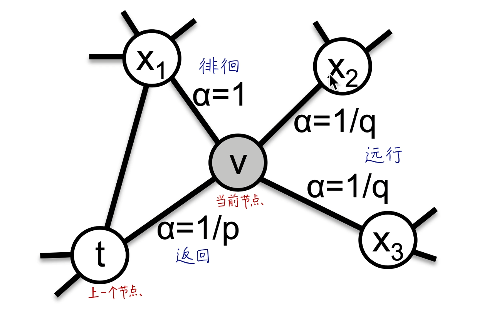

``1.当前v结点 有1/q的概率（权重）走向X2X3，有1/p的概率（权重）走向上一个节点t，还有1的概率（权重）走到X1（X1和t的距离等于v到t的距离 不走远也不走近）``

``2.pq取值范围不是[0,1]``

**调节pq的值 使其有偏随机游走 远行dfs  返回bfs** 

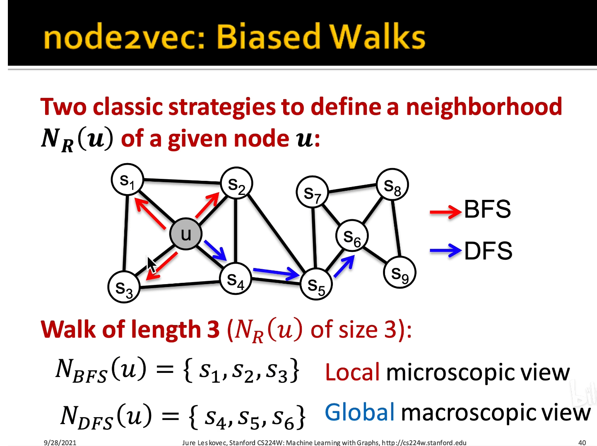

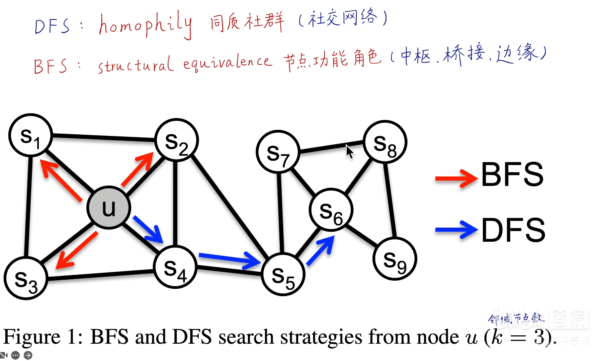

#### 2阶随机游走

- 不仅取决于当前结点还取决于上一个节点（node2vec的random walk）

- 只取决于当前的结点（deep walk中的random walk）

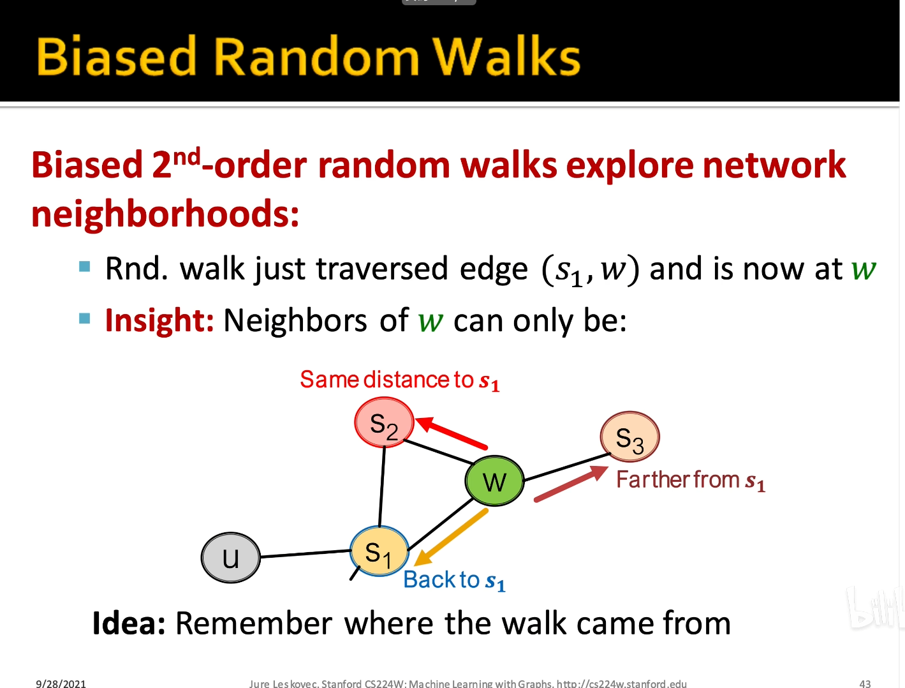

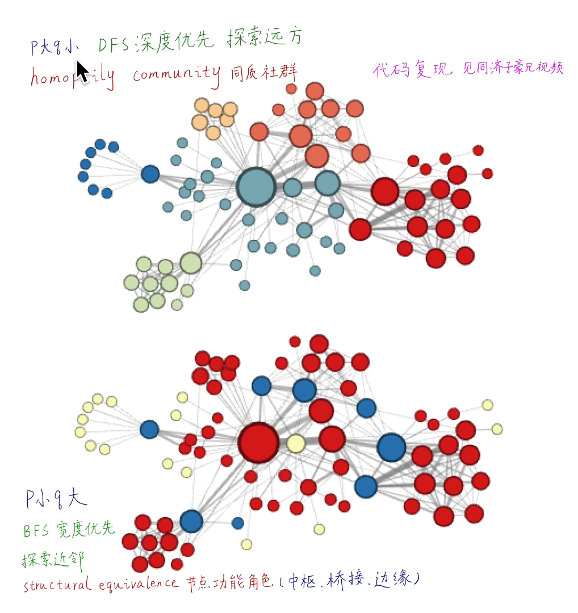

#### 伪代码

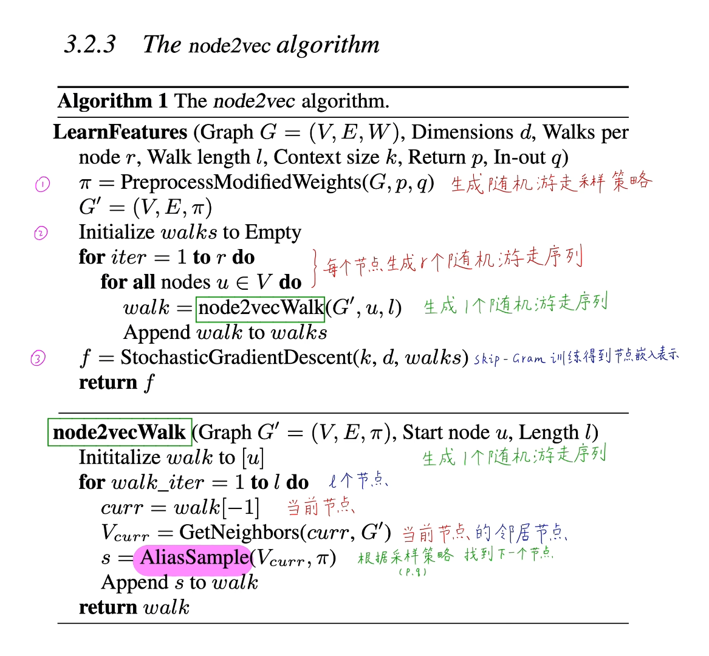

#### 和deep walk对比

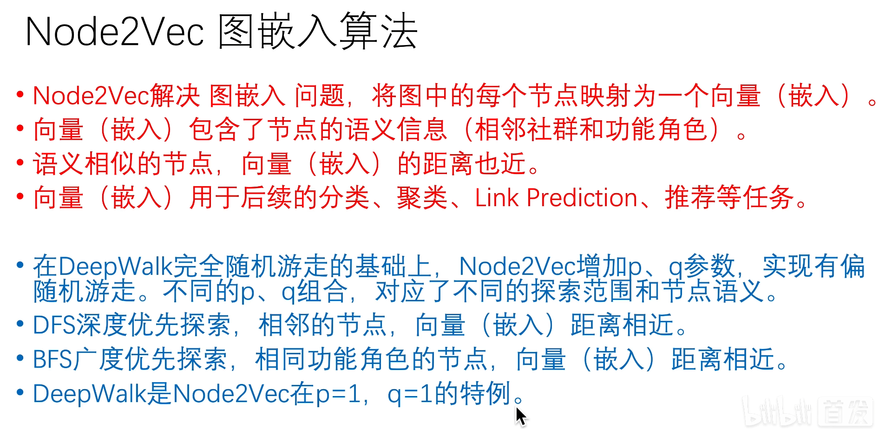

#### sumarry

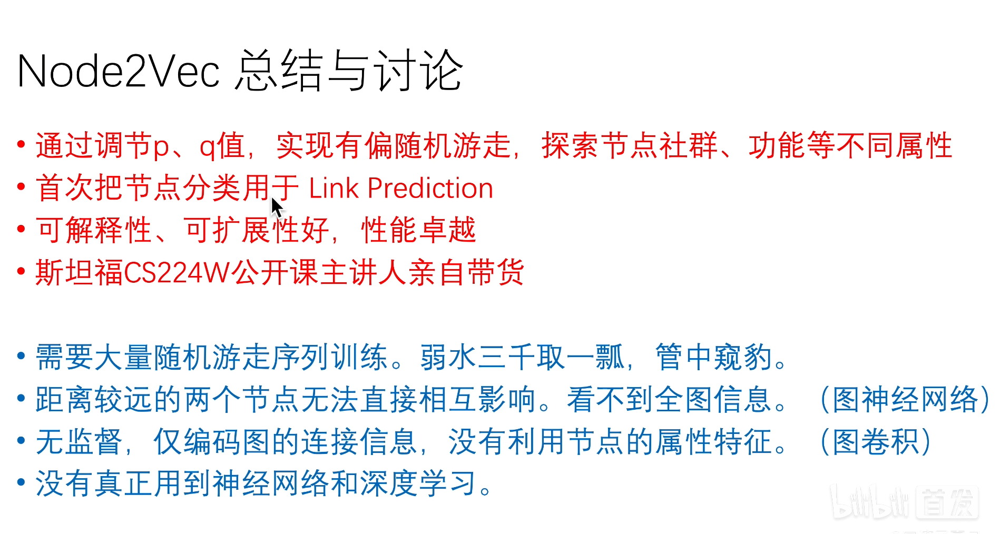

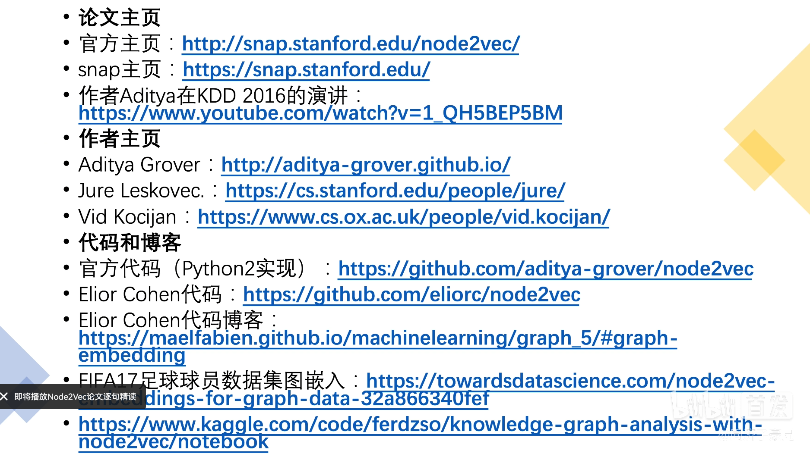

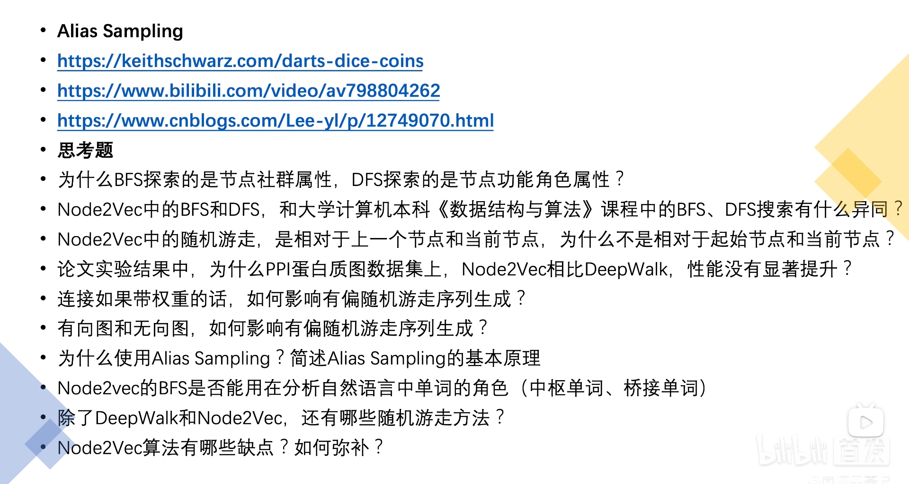

#### 传统的机器学习 数据重要的三个特征

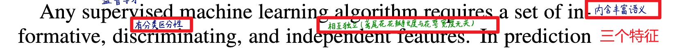

### node2vec

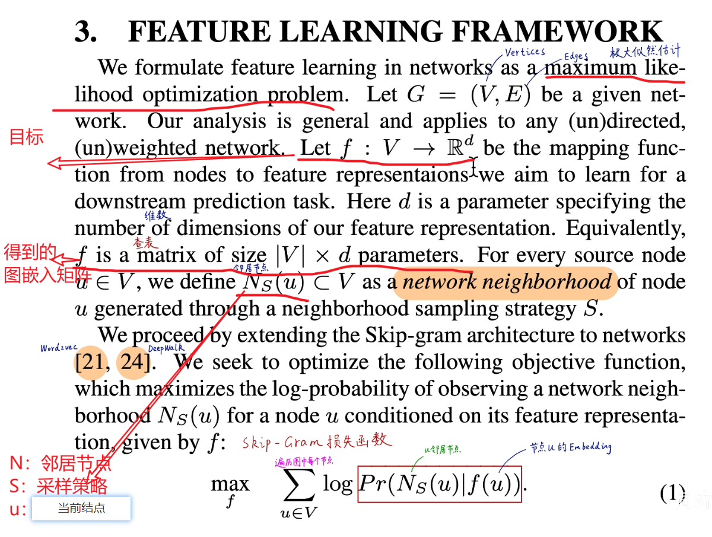

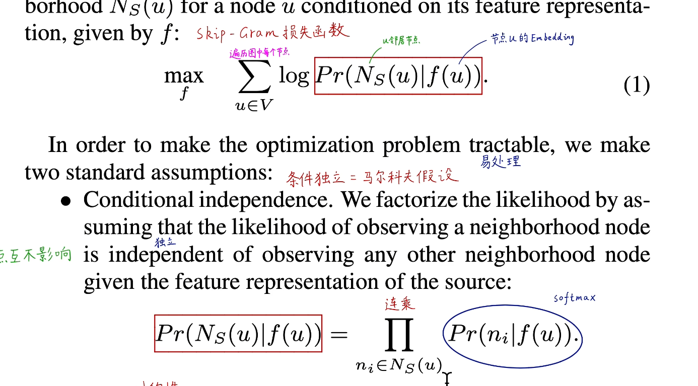

#### link embedding

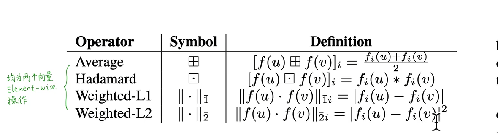

#### 正负样本的定义

正样本使用图的50% 删除这50%后图仍然保持连通性

负样本使用图中不相连的点

#### link prediction

1. 先得到node 的embedding
2. 用node embedding得到link embedding
3. 使用link embedding 进行二分类

启发式方法（并不限于以下四种）（不科学）将node embedding转换为link embedding

N（u）u结点附近的N个结点

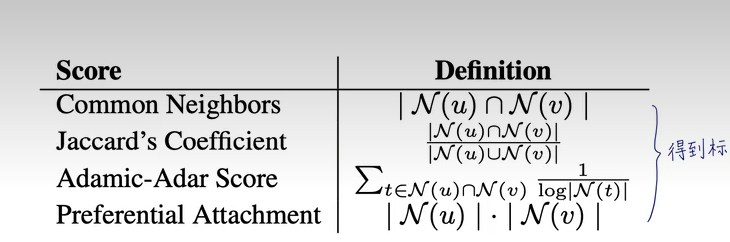
