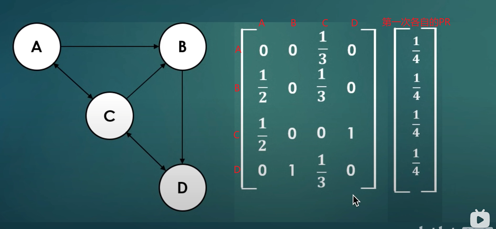
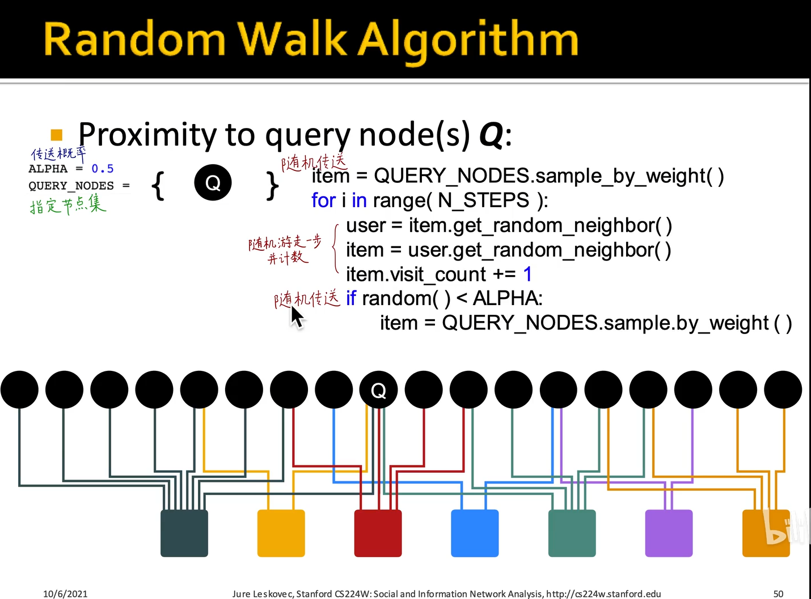

## PageRank

#### 三种算法

### 五个角度理解pagerank

**默认每个网页的初连接的PR是一样的**

**1.前三个都是以结点的重要度/出度求和得到某个节点的重要度(PR)**

2.

#### 线性方程组

**高斯消元法**

``1.B->D 是指D网页被B节点引用``

``2.A的iteration1 PR(A)=1/4/3=1/12 只有C引用了A 并且C有三条出去的线，即C被引用了三次``

#### 2.迭代左乘M矩阵

#### 矩阵的特征向量

#### 随机游走

**随机游走计数求和再归一化**

``每个网页的出连接是一样的 eg：i1有三条出连接，每条的出连接的PR都等于PR/3``

#### 马尔科夫链

状态转移链 也是概率

### 求解PageRank

**模拟随机游走消耗计算机资源 不推荐**

**L1范数收敛到一个范围**

##### example：

### 敛散性分析

#### 不是这两种马尔科夫链（reducible可减少的 和periodic周期的）就可以收敛

#### 有多个连通域是属于这两种马尔科夫链的

### 对于奇葩的连接结点是否能得到我们想要的重要度？

#### 死胡同 （dead end）

**solution：让你100%被传走**

#### 仅指向自己（spider trap）

**solution：有一定概率被传走 不让你一直在抖音**

#### 数学上的证明

### example：

1.不能自己刷高 得需要大佬引用你

**并行计算PR**

### PageRank的变种

#### 用于推荐系统

``二部图``

### 总结

PageRank、Personalized PageRank和Random Walk with Restart都是用于计算节点在图中的重要性的算法，它们的主要区别如下：

1. PageRank是一种无偏向性的算法，用于计算图中所有节点的重要性。PageRank假设所有节点的初始重要性相等，并在迭代计算中考虑节点间的连接关系，逐步更新节点的重要性得分。最终得分可以用于比较不同节点的重要性。
2. Personalized PageRank是一种有偏向性的算法，用于计算与给定节点相关的其他节点的重要性。Personalized PageRank将给定节点作为起点，计算与其相关的节点的重要性。这种算法通常用于推荐系统中，以计算用户与其他用户或物品之间的相似性和关联度。
3. Random Walk with Restart也是一种有偏向性的算法，用于计算与给定节点相关的其他节点的重要性。与Personalized PageRank不同的是，Random Walk with Restart将概率随机游走的方式作为计算节点重要性的依据。具体来说，在每一次迭代中，节点有一定概率停留在当前节点，有一定概率按照连接关系随机移动到其他节点，同时还有一定概率重新回到给定节点。最终得分可以用于比较与给定节点相关的其他节点的重要性。

需要注意的是，这三种算法都是基于图的分析方法，它们的计算效率和精度会受到图的大小、结构和稀疏性等因素的影响。在具体应用时，需要根据实际情况选择合适的算法，并结合其他算法和技术进行综合分析和处理。