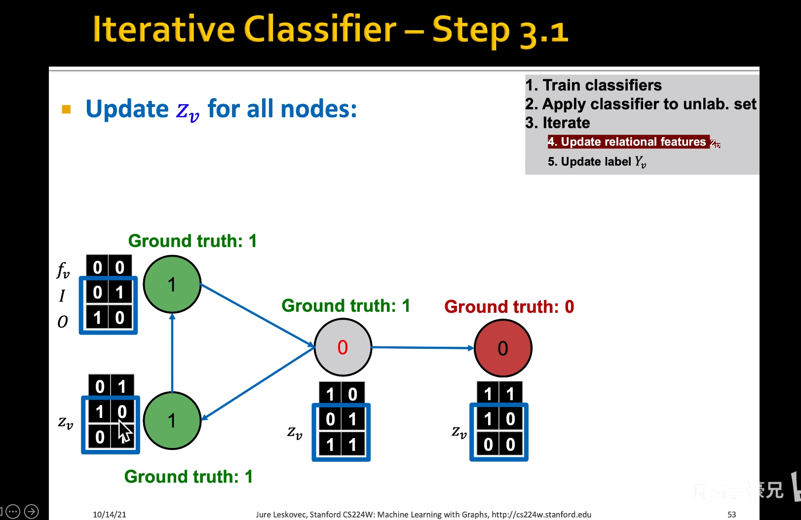
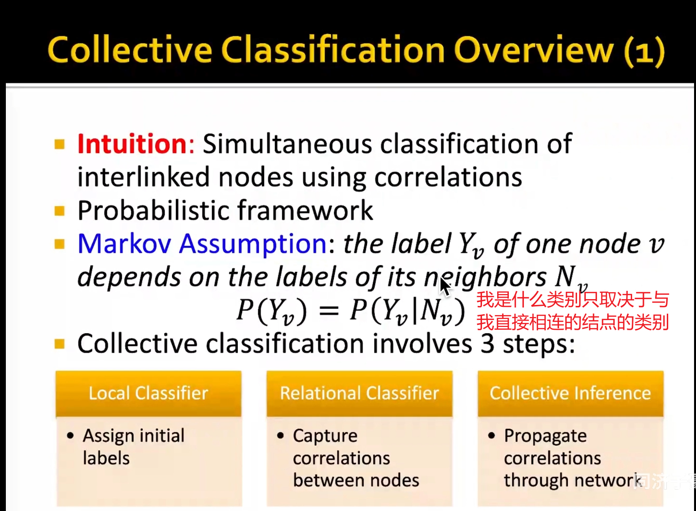
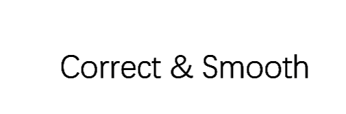

## 半监督节点分类（label propagation）

#### 两个概念（直推式学习 transductive和归纳式学习 inductive）

``直推式学习：训练模型前后不会改变 图的形状前后不变``

#### 例子

### 重要的对比

### 标签传播和集体分类

#### 进入正题

#### 最简单knn

### lable propagation标签传播算法

#### example

#### iteration：一轮收敛一个  

#### 方法

**缺点**：

- 仅用到网络连接信息，没有用到节点属性特征
- 可能不会convergence（收敛）

#### 代码调包

### ICA算法

#### 方法

#### example

**没使用连接属性 Zv**

**使用连接属性Zv**

**然后按照上面的方法进行训练**

**之后iteration：使用Yz（Φ2）更行Zv，使用Zv更新Yz（Φ2） 达到收敛或者最大迭代次数结束** 

#### 马尔科夫假设

### 总结以上两种算法

### 后处理的算法

#### 方法

##### 后处理将这些不太确信的结点让其变的确信 eg：将8号结点变的确信

#### corretc步骤 传播error matrix矩阵

**是将错误 困惑传播到需要分类的结点**

##### Normalized diffusion（Adjacency） matrix 归一化矩阵

#### smooth步骤 传播置信度matrix

**将初始都有标注的置信度默认为1 对比correct之后的图 **

#### 对比后处理和没后处理的图

### Loopy Belief Propagation 消息传递算法

#### 问题 ：有环怎么办

**不断循环就会加强虚假消息的传播**

#### 优点

### Masked Label Prediction 

``相当于自己挖空做完形填空``

### summary

